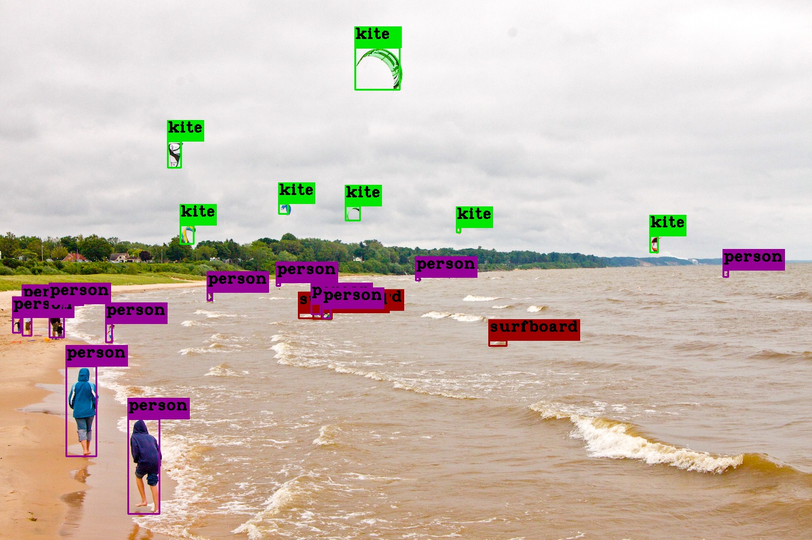
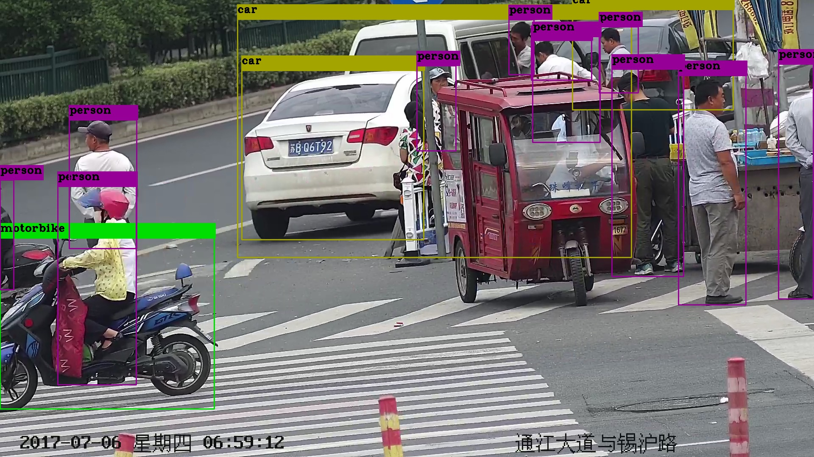
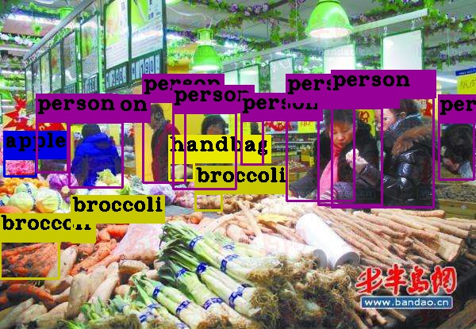

### Introduction
&emsp;&emsp;In this project, we use the lastest detection model Yolov4 to detect the custom images, videos or web camera videos with C++.  
&emsp;&emsp;Reference blog:https://www.jianshu.com/p/24174ca9685a
### Step
```
git clone https://github.com/xyl3902596/Yolov4detect.git
cd Yolov4detect
sudo cp libdarknet.so /usr/lib
cmake .
make
./yolov4 image/kite.jpg     //image
./yolov4 test.mp4             //video
./yolov4 web_camera      //webcamera
```
## result
 
 
 

## Concat
    Author:Xi Yunlong, Shanghai JiaoTong University,China
    Email:XiYunlong111@outlook.com
